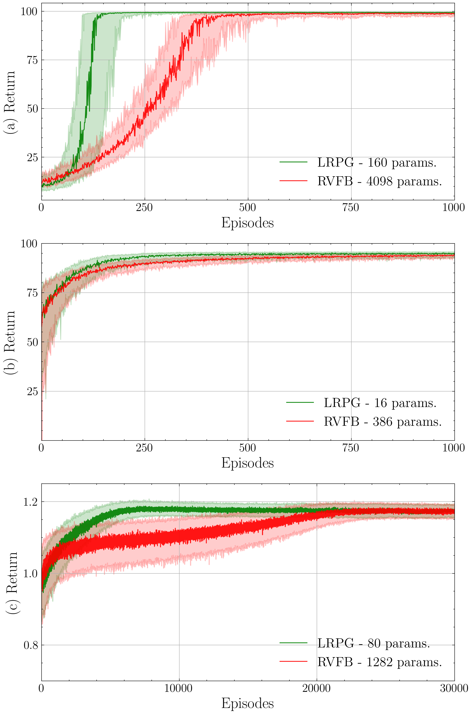

# Matrix Low-Rank Approximation For Policy Gradient Methods

by
Sergio Rozada,
and Antonio G. Marques

This code belongs to a paper that has been published in *ICASSP 2023*.

> The associated paper presents low-rank matrix models for Policy Gradient (PG) methods. They are easy to tune, and parametrize. They outperform neural networks in terms of size, and returns.

    

*Median return per episode in three standard RL problems:
(a) the pendulum, (b) the acrobot, and (d) the Goddard problem.*

## Abstract

> Estimating a policy that maps states to actions is a central problem in reinforcement learning. Traditionally, policies are inferred from the so-called value functions (VFs), but exact VF computation suffers from the curse of dimensionality. Policy gradient (PG) methods bypass this by learning directly a parametric stochastic policy. Typically, the parameters of the policy are estimated using neural networks (NNs) tuned via stochastic gradient descent. However, finding adequate NN architectures can be challenging, and convergence issues are common as well. In this paper, we put forth low-rank matrix-based models to estimate efficiently the parameters of PG algorithms. We collect the parameters of the stochastic policy into a matrix, and then, we leverage matrix-completion techniques to promote (enforce) low rank. We demonstrate via numerical studies how low-rank matrix-based policy models reduce the computational and sample complexities relative to NN models, while achieving a similar aggregated reward.

## Software implementation

All source code used to generate the results and figures in the paper are in the `src` folder. The calculations and figure generation are all done by running:
* `1_pendulum_experiment.py`
* `2_acrobot_experiment.py`
* `3_rocket_experiment.py`
* `4_plot.py`

Results generated by the code are saved in `results`, and figures are saved in `figures`.
See the `README.md` files in each directory for a full description.

## Getting the code

You can download a copy of all the files in this repository by cloning the
[git](https://github.com/sergiorozada12/matrix-low-rank-pg) repository:

    git clone https://github.com/sergiorozada12/matrix-low-rank-pg.git

or [download a zip archive](https://github.com/sergiorozada12/matrix-low-rank-pg/archive/refs/heads/main.zip).

## Dependencies

You'll need a working Python environment to run the code.
The recommended way to set up your environment is through [virtual environments](https://docs.python.org/3/library/venv.html). The required dependencies are specified in the file `requirements.txt`.
